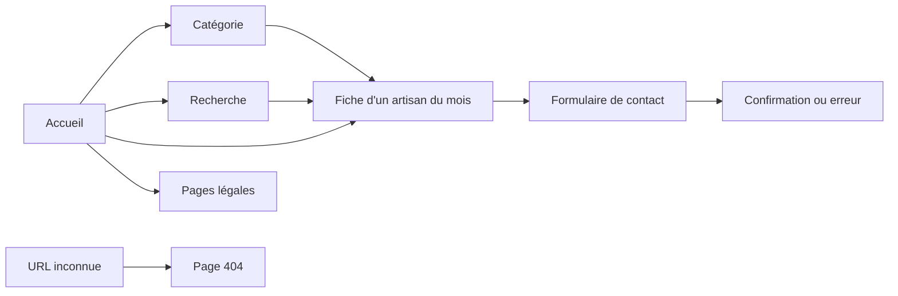

# Conception fonctionnelle et technique

## Périmètre

Le site est un annuaire public en lecture. Il ne possède ni compte utilisateur, ni administration, ni paiement. Le seul traitement métier en écriture est l'envoi d'une demande à un artisan.

## Parcours



## Architecture cible

```text
Navigateur
  -> React Router et composants
  -> client HTTP centralisé sur /api
  -> Nginx en production / Vite en développement
  -> routes Express
  -> contrôleurs HTTP
  -> services métier
  -> modèles Sequelize
  -> MySQL
```

Cette séparation applique SoC : chaque couche a une raison principale de changer. DRY s'applique aux contrats, validations et composants réellement communs, mais ne justifie pas une abstraction prématurée.

## Contrat API prévu

| Méthode | Route | Usage |
| --- | --- | --- |
| GET | `/health` | Santé d'Express et MySQL |
| GET | `/categories` | Menu ordonné |
| GET | `/categories/:slug/artisans` | Catalogue d'une catégorie |
| GET | `/artisans` | Liste et recherche avec paramètres bornés |
| GET | `/artisans/featured` | Trois artisans du mois |
| GET | `/artisans/:slug` | Fiche publique sans e-mail |
| POST | `/artisans/:slug/contact` | Validation puis envoi serveur |

## Menaces principales anticipées

- injection SQL : Sequelize paramètre les requêtes et les entrées sont validées ;
- XSS : React échappe le texte, les URL sont contrôlées et aucun HTML métier brut n'est rendu ;
- spam/contact : limites de taille, validation, rate limiting et honeypot ;
- injection SMTP : aucun retour à la ligne dans les champs d'en-tête ;
- fuite de données : l'adresse artisan ne quitte pas le backend ;
- exposition réseau : seul Nginx rejoint Traefik, Express et MySQL restent privés ;
- secrets : variables locales ignorées, jamais de secret en `VITE_*` ;
- erreurs : message public stable, détail réservé aux journaux sans données personnelles.
