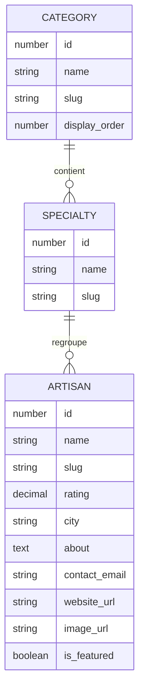

# Conception de la base de données

## Modèle conceptuel de données (MCD)



Règles de gestion du projet :

- une catégorie contient zéro à plusieurs spécialités ;
- une spécialité appartient à exactement une catégorie ;
- une spécialité regroupe zéro à plusieurs artisans ;
- un artisan appartient à exactement une spécialité ;
- la catégorie d'un artisan est donc obtenue par sa spécialité, sans colonne redondante dans `artisans` ;
- un artisan peut ne pas avoir de site ou d'image ;
- l'e-mail est nécessaire au contact, mais ne fait pas partie de son profil public.

## Modèle logique de données (MLD)

```text
CATEGORY(
  #id, name [UQ], slug [UQ], display_order [UQ], created_at, updated_at
)

SPECIALTY(
  #id, name, slug [UQ], created_at, updated_at,
  category_id [NN] -> CATEGORY.id,
  UNIQUE(category_id, name)
)

ARTISAN(
  #id, name, slug [UQ], rating, city, about, contact_email,
  website_url?, image_url?, is_featured, created_at, updated_at,
  specialty_id [NN] -> SPECIALTY.id
)
```

`#` désigne une clé primaire, `[NN]` une valeur obligatoire, `[UQ]` une valeur unique et `?` une valeur facultative.

## Choix techniques

- InnoDB garantit les clés étrangères et les transactions.
- `utf8mb4_0900_ai_ci` stocke correctement les accents et permet des comparaisons insensibles à la casse et aux accents, utiles à la recherche.
- Les clés numériques sont petites parce que le domaine est limité, tandis que les URL utilisent des slugs lisibles et stables.
- `DECIMAL(2,1)` représente exactement une note sur cinq, contrairement à un flottant approximatif.
- `RESTRICT` empêche de supprimer une catégorie ou spécialité encore utilisée.
- La catégorie n'est pas dupliquée sur l'artisan : cela évite des incohérences et respecte la troisième forme normale.
- `contact_email` est stocké pour le serveur SMTP, mais les futurs DTO publics devront toujours l'exclure.

## Index

- Les contraintes uniques créent leurs propres index sur noms/slugs utiles.
- `specialties.category_id` accélère la navigation par catégorie.
- `artisans.specialty_id` accélère les jointures.
- `artisans.name` aide les recherches préfixées ; une recherche `%terme%` sur 17 lignes reste acceptable, mais un moteur plein texte serait à étudier à grande échelle.
- `artisans.is_featured` accélère la récupération des artisans du mois.

## Données fournies

Le seed conserve les 17 lignes du tableur, y compris les graphies qui paraissent éventuellement fautives. Il ajoute seulement des identifiants et slugs techniques. Il contient 4 catégories, 15 spécialités et exactement 3 artisans marqués comme vedettes.
